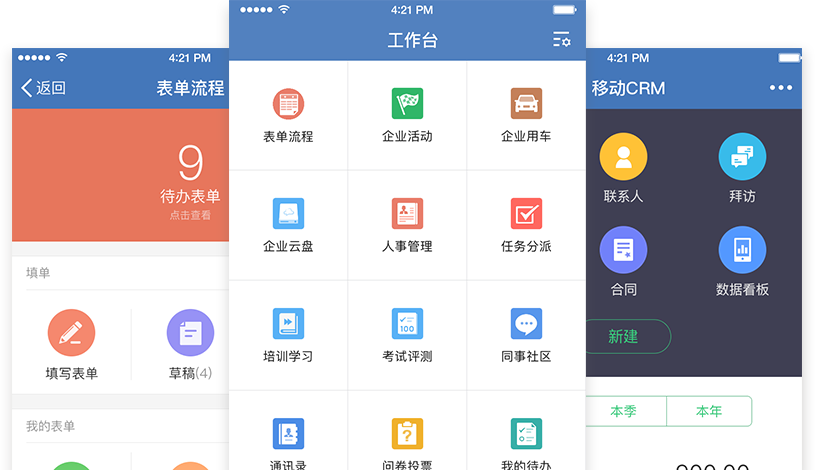

# weiwork 项目介绍 
微信企业号管理系统 Java企业微信开发源码框架,获取AccessToken,发送消息

### 微信企业号管理系统源码框架

1. 使用springboot框架
2. 基础签名验证,附加强加密算法jar
3. 获取accessToken
4. 发送消息
5. 扩展对接其他系统(联系开发者定制)

| 扩展系统 | 扩展功能说明 |
| ------ | -------------------------------- | 
| 表单流程 | 通过表单设计器及流程引擎  快速搭建企业工作流 费控报销|
| 费控报销 | 自动生成报销单，随时随地  审批，缩短员工报销周期 会议助手| 
| 会议助手 | 会议室查询预定、一键通知  开会人员,微信会议签到 移动外勤 | 
| 移动外勤 | 快速联系，跨部门沟通快速  联系，跨部门沟通 培训学习 | 
| 培训学习 | 搭建移动培训平台，员工随  时随地可以进行学习 考试评测| 
| 考试评测 | 支持自建题库、系统智能出 卷、改卷，成绩自动统计  | 
| 新闻公告 | 新闻公告消息通告、员工生日周年关 怀、微信工资条发放  | 
| 开放API| 开放API企微云开放应用API，方便与 其他OA、CRM、ERP、财务 系统进行集成 | 

## 扩展对接系统演示

#### 参与贡献

1. Fork 本项目
2. 新建 Feat_xxx 分支
3. 提交代码
4. 新建 Pull Request

## 关于作者
bywei = 程序员百味

个人博客 = "http://www.bywei.cn"

## 用户协议
* 禁止用户在使用中触犯中国法律范围内的任何法律条文。
* 不通过出售任何以此项目为基础开发的产品，仅用作自身学习研究使用。
* 任何个人，公司和组织不得以任何形式和目的侵犯百味博客的版权和著作权。
* 在未经官方书面允许的情况下，任何个人、公司和组织不能单方面发布和出售以此项目为基础开发的任何互联网软件或者产品，否则将视为侵权行为，将依照中华人民共和国法律追究其法律责任。